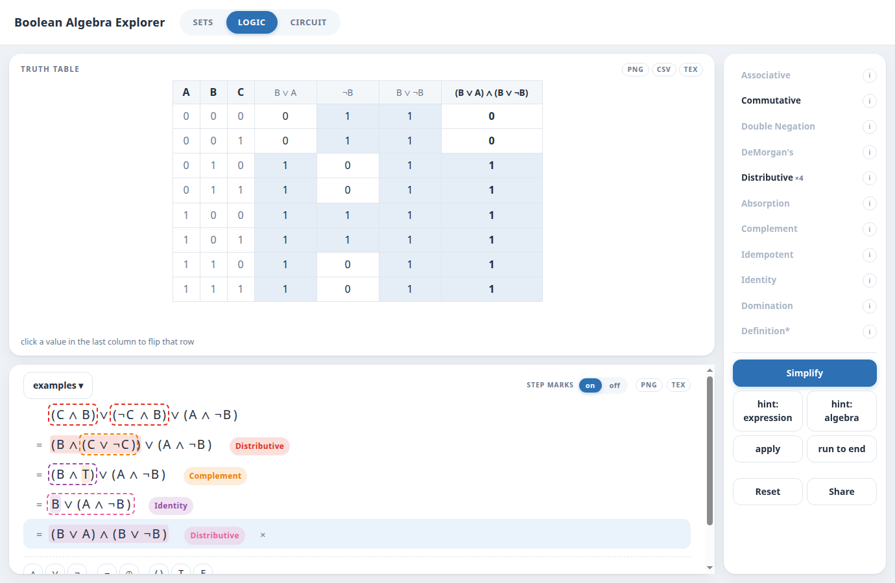
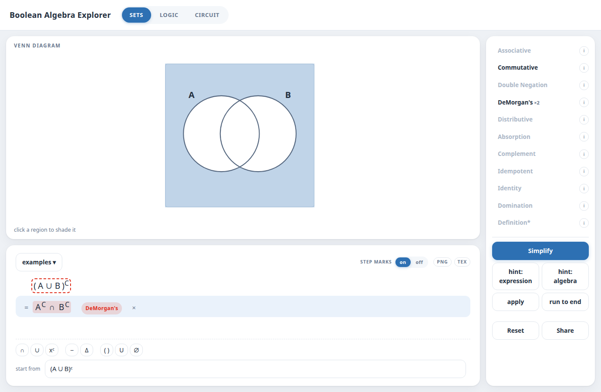

# boolalg — Boolean Algebra Explorer

A browser tool for CS1800 that shows a boolean/set expression three ways
at once — symbols, a derivation, and a picture (Venn diagram in sets
mode, truth table + circuit in logic mode) — so that applying an
identity is visibly a rewrite that does not change the picture.

**[Try it](https://matthigger.github.io/boolalg/)** — no install, no login.

Sets mode shows the same expression as a Venn diagram:

- **docs/** — the app. Plain ES modules, no build step: deploy the
  folder, or run `python3 serve.py` and open the port it prints. Use
  that rather than `python3 -m http.server`, which sends no
  `Cache-Control` and will happily serve a stale module after an edit.
  Tests are `docs/test.html` (core) and `docs/uitest.html`
  (interaction); both print `RESULT pass=N fail=N`.
- **[SPEC.md](SPEC.md)** — the specification. Start here.
- **reference/** — the CS1800 `logic_set_identities` handout (PDF +
  ODT source) that the rule set is taken from; transcribed in
  SPEC.md Appendix A and encoded in Appendix B.
- **proto/** — a Python prototype of the minimiser (SPEC.md section 7),
  written to test its one real assumption before committing to it.
  Results in [proto/FINDINGS.md](proto/FINDINGS.md); run with
  `python3 run_experiment.py`.
- **patches/** — fixes for two errors the prototype found in
  `CS1800/problem_repo`. Not applied.

Expressions go in as symbols (`(A u B)^C`), words (`comp(sunny or
warm)`) or LaTeX (`\overline{A \cup B}`), with a key of operator
buttons for the glyphs no keyboard has. Variables can be named. Work
comes out as PNG, CSV or LaTeX — the truth table, the derivation, and
the circuit.

Status: working prototype, 254 tests passing (108 core, 146
interaction). Section 18 records every design decision with the evidence
behind it — mostly the course's own problem sets and rubrics in
`CS1800/problem_repo` — and lists what is still open.
